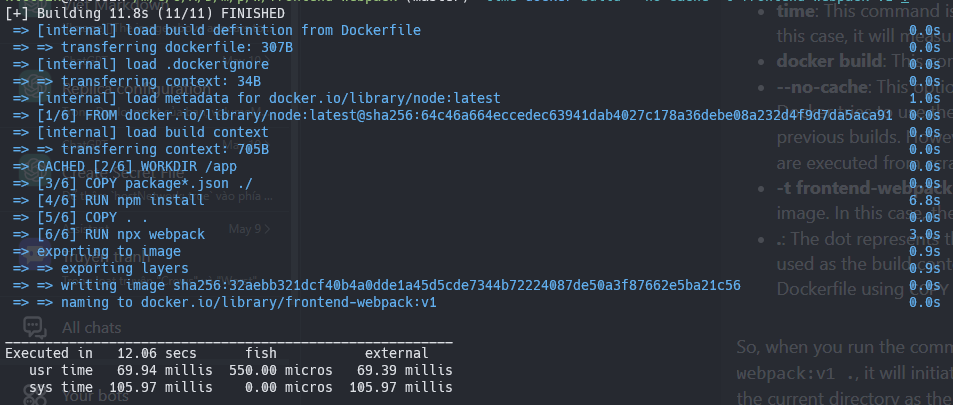
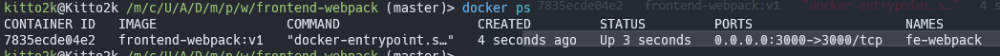
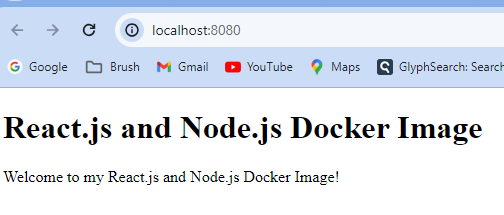

# How to package front-end projects into Docker images and use it with webpack

Maybe someone thinks this is useless for front-end developer, but I think for me, developing a project in front-end is more complicated than before, and also include part of setting environment.

For example, if I want to run a project, I need to install node or I should install webpack if this project using webpack? I can’t just run the project? and make the project work? and perhaps the project also need rely on database?

- Create Repo: [create repo](#1-create-project-react.js-and-node.js)
- Create Dockerfile: [create dockerfile](#2-create-dockerfile)
- Run images: [build and run images](#3-run-images)
- Quickly: [quickly start](#4-quick-start)

Can I easy to integrate and manage front-end projects with back-end projects?

## 1. Create Project React.js and Node.js

1. Create a new directory for your project and navigate to it using your terminal.

```bash
mkdir frontend-webpack
cd frontend-webpackk
```

2. Create a new `package.json` file for your project by running the following command

```bash
npm init -y & npm install express react react-dom
```

3. Create a new `index.js` file in your project directory and add the following code

```js
const express = require('express')
const app = express();

app.use(express.static('public'));

app.get('/', (req, res) => {
  res.sendFile(__dirname + '/public/index.html');
});

app.listen(3000, () => {
  console.log('App listening on port 3000!');
});
```

4. Create a new `public` directory in your project directory and add a new `index.html` file with the following code

```html
<!DOCTYPE html>
<html>
  <head>
    <title>React.js and Node.js Docker Image</title>
  </head>
  <body>
    <div id="root"></div>
    <script src="bundle.js"></script>
  </body>
</html>
```

5. Create a new `src` directory in your project directory and add a new `App.js` file with the following code

```js
import React from 'react';

const App = () => {
  return (
    <div>
      <h1>React.js and Node.js Docker Image</h1>
      <p>Welcome to my React.js and Node.js Docker Image!</p>
    </div>
  );
}

export default App;
```

6. Create a new `index.js` file in your `src` directory and add the following code

```js
import React from 'react';
import ReactDOM from 'react-dom';
import App from './App';

ReactDOM.render(<App />, document.getElementById('root'));
```

7. Install the necessary development dependencies by running the following command

```bash
npm install webpack webpack-cli webpack-dev-server babel-loader @babel/core @babel/preset-env @babel/preset-react --save-dev
```

8. Create a new `webpack.config.js` file in your project directory and add the following code

```js
const path = require('path');
module.exports = {
	entry: './src/main.js',
	output: {
		path: path.resolve(__dirname, 'public'),
		filename: 'bundle.js',
	},
	module: {
		rules: [{
			test: /\.js$/,
			exclude: /node_modules/,
			use: {
				loader: 'babel-loader',
				options: {
					presets: ['@babel/preset-env', '@babel/preset-react'],
				},
			},
		}, ],
	},
	devServer: {
		contentBase: path.resolve(__dirname, 'public'),
		port: 3000,
	},
};;
```

9. Build your React.js and Node.js application by running the following command

```bash
npx webpack
```

## 2. Create Dockerfile

- Okay, the first step still is install, please refers [docker’s document](https://docs.docker.com/get-docker/), I think it is clearest.

If you want to build a docker image, you should throw Dockerfile. we will write something that about how do you want to execute the project and environment of execution of the project. Below is a basic context of Dockerfile

```yaml
FROM node:latest

LABEL version="latest"
LABEL description="This is webpack reactjs + nodejs with Docker image."
LABEL maintainer="anon07@proton.me"

WORKDIR /app

COPY package*.json ./

RUN npm install

COPY . .

RUN npx webpack

EXPOSE 3000

CMD ["node", "index.js"]
```

So, let's go through the Dockerfile:

- **FROM**: This specifies the base image to build upon. In this case, you're using the latest version of the Node.js image.
- **LABEL**: These lines define metadata for the Docker image. The version label indicates the version of the image, the description label provides a brief description of the image, and the maintainer label specifies the contact information of the person maintaining the image.
- **WORKDIR**: This sets the working directory inside the container where subsequent commands will be run. In this case, the working directory is set to /app.
- **COPY**: The COPY command copies files or directories from the host into the container's working directory. Here, you're copying the package.json file to the working directory.
- **RUN**: This command allows you to execute commands inside the container during the image build process. In this step, you're running npm install to install the project's dependencies based on the package.json file.
- **COPY**: Here, you're copying all the remaining files from the host into the container's working directory.
- **RUN**: This step runs npx webpack to build the project using webpack.
- **EXPOSE**: This informs Docker that the container will listen on port 3000 at runtime. It's a way to document that the container expects connections on that port.
- **CMD**: This specifies the default command to run when the container starts. In this case, it will execute the command node index.js to start your application.

In the step, we create a Dockerfile, otherwise we also can create a **.dockerignore** which can ignore file or folder during building images. For example, maybe I don’t want to copy **node_modules** to `WORKDIR`, because I will run npm install during building image, for that I can write below snippet in .dockerignore

File `.dockeignore`

```yaml
.git
.gitignore
node_modules
npm-debug.log
dist
```

After we finished above things, we can run the command which building a image

```bash
time docker build --no-cache -t frontend-webpack:v1 .
```

We can type docker build to build a image, -t meaning is tag name, --no-cache will not use the cache for the build, you can add tag name for your images, the format is image name:tag name, last is your path of project which you want to defined the project root path.

 

If have no display any problem, we type docker images in terminal, we can find out our image.

```bash
REPOSITORY         TAG       IMAGE ID       CREATED          SIZE
frontend-webpack   v1        32aebb321dcf   24 minutes ago   1.18GB
```

## 3. Run images

Next, please type below commands for run images

```bash
docker run -itd --name fe-webpack -p 8080:3000 frontend-webpack:v1
```

We can use docker run imageID format execute a image, and a same time, a container will started, our image will run in the container.

So our webpack-dev-server run our project on 8080 port, but it is running in the container, we need to export 3000 port of container to our 8080 port of localhost. For that, we need to add -p 8080:3000 into commands, the format is -p **[port of localhost]:[part of container]**.

After running your images, we can type above commands to see running container with image.

 

And we can open browser, enter [localhost:8080](http://localhost:8080) into url, the project is work 🎊



If you want to stop or delete container and image you can refers below commands

```bash
// delete images
docker rmi imageID

// stop containers
docker stop containerID

// delete containers
docker rm containerID
```

## 4. Quick start

Clone repo

```bash
git clone https://github.com/nulldoot2k/frontend-webpack-dockerfile.git
cd frontend-webpack-dockerfile
```

Run `docker-compose.yml`

```bash
docker-compose up -d

==> Result
✔ Network frontend-webpack_default  Created
✔ Container fe-webpack              Started
```

Delele `docker-compose.yml`

```bash
docker-compose down

==> Result
✔ Container fe-webpack              Removed
✔ Network frontend-webpack_default  Removed
```

## Thank for you read! 😃
